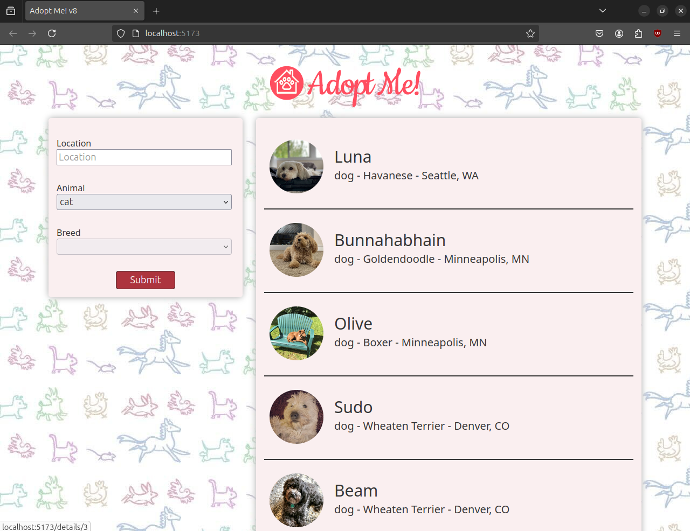

# AdoptMe - Pet Adoption Site

Welcome to **AdoptMe**, a simple and user-friendly pet adoption website built with **ReactJS** and **JavaScript**. This project allows users to browse and adopt pets from a virtual adoption center.

## Features

- **User Interface**: Clean and simple frontend designed for ease of use.
- **Pet Listings**: View available pets for adoption.
- **Adopt a Pet**: Choose a pet and initiate the adoption process.

## Getting Started

To run the project locally or simulate the app, follow the steps below:

### Prerequisites

Make sure you have the following installed:
- **Node.js** (https://nodejs.org/)
- **npm** (Node Package Manager)

### Installation

1. Clone the repository to your local machine:

   ```bash
   git clone https://github.com/vickvey/adopt-me.git
   cd AdoptMe-PetAdoptionSite/

2. Install the required dependencies:

   ```bash
   npm install

3. Start the development server:

   ```bash
   npm run dev

This will start a development server at [localhost](http://localhost:5173/). Click the link and see the demo.

### Demo Image
Below is a screenshot of the **AdoptMe** application in action:


### Acknowledgments
- ReactJS for the powerful front-end library.
- Inspiration from various pet adoption websites.

